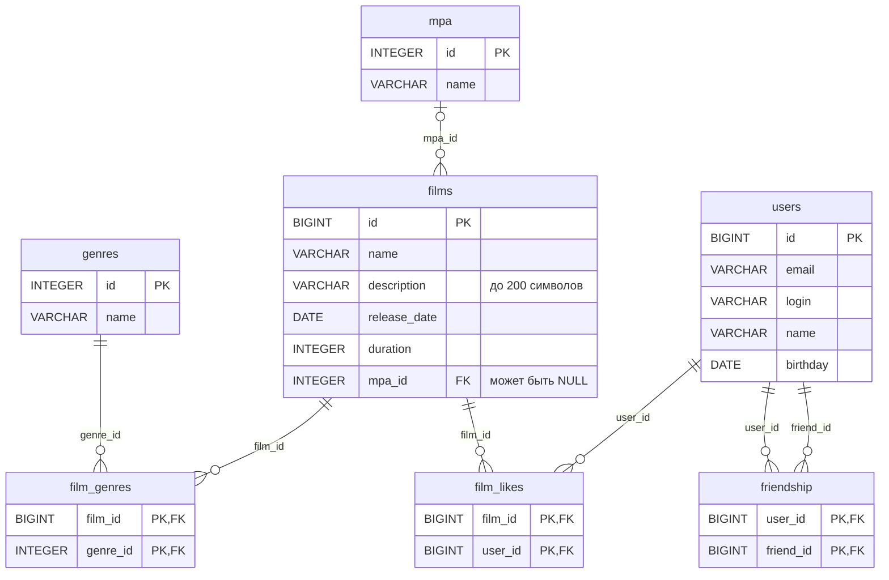

# java-filmorate

Учебный backend-проект на Java и Spring Boot: сервис для работы с фильмами,
оценками пользователей и топом популярных фильмов.

Проект развивается поэтапно. На текущем этапе данные хранятся в реляционной базе H2,
доступ к ним — через `JdbcTemplate`, у фильмов появились жанры и возрастной рейтинг MPA.

## Автор
**Ксения Пылькина** *(Ksenia Pylkina)*

## Ключевые возможности на данном этапе

- CRUD-операции для `Film` и `User` (создание, обновление, получение по ID и списком).
- Хранение данных в базе H2 (файловый режим — данные переживают перезапуск),
  доступ через `JdbcTemplate` и `RowMapper`.
- Справочники жанров и рейтингов MPA в базе, эндпоинты `/genres` и `/mpa`.
- У фильма есть рейтинг и список жанров; жанры в ответе — без дублей, по порядку id.
- Односторонняя дружба: добавление/удаление друзей, список друзей, общие друзья.
- Лайки фильмам: добавление/удаление, топ-N фильмов по количеству лайков.
- Слоистая архитектура: контроллер → сервис → хранилище, выбор реализации хранилища через `@Qualifier`.
- Внедрение зависимостей через конструктор (`@Autowired`).
- Строгая валидация входящих данных через `spring-boot-starter-validation`.
- Кастомная бизнес-валидация (дата релиза, пробелы в логине, автозамена имени на логин,
  существование рейтинга и жанров).
- Централизованная обработка ошибок (`@RestControllerAdvice`): 400, 404, 500.
- Логирование HTTP-запросов и ответов через Logbook.
- Unit-тесты бизнес-логики и интеграционные тесты хранилищ (`@JdbcTest`).

## Технологии

- **Java 21**
- **Spring Boot 3.2.2**
    - `spring-boot-starter-web` (REST API)
    - `spring-boot-starter-validation` (валидация данных)
    - `spring-boot-starter-jdbc` (доступ к базе через `JdbcTemplate`)
- **H2 Database** (встроенная реляционная база данных)
- **Logbook 3.7.2** (логирование HTTP-запросов)
- **Lombok** (генерация boilerplate-кода и логгеров)
- **JUnit 5**, **Spring Boot Test**, **Mockito** (unit- и интеграционные тесты)
- **Maven** (сборка проекта)
- **Checkstyle** (контроль стиля кода)

## Запуск проекта

1. Склонировать репозиторий.
2. Открыть проект в **IntelliJ IDEA**.
3. Дождаться загрузки зависимостей Maven.
4. Запустить метод `main` в классе `FilmorateApplication`.

После запуска сервер будет доступен на порту **8080**.

База данных создаётся автоматически при старте: таблицы — из `schema.sql`,
справочники жанров и рейтингов — из `data.sql`. Данные хранятся в папке `db`
в корне проекта. Чтобы начать с чистой базы, остановите приложение и удалите эту папку.

Содержимое базы можно посмотреть в консоли H2: `http://localhost:8080/h2-console`
(JDBC URL `jdbc:h2:file:./db/filmorate`, пользователь `sa`, пароль `password`).

Для проверки запросов можно использовать **Postman**
(коллекция `sprint.json` доступна в шаблоне курса).

## Основные HTTP-эндпоинты

### Фильмы (`/films`)
- `GET /films` — получить список всех фильмов.
- `GET /films/{id}` — получить фильм по ID.
- `POST /films` — добавить новый фильм.
- `PUT /films` — обновить существующий фильм.
- `PUT /films/{id}/like/{userId}` — поставить лайк фильму.
- `DELETE /films/{id}/like/{userId}` — убрать лайк.
- `GET /films/popular?count={count}` — топ-N фильмов по лайкам (по умолчанию 10).

### Пользователи (`/users`)
- `GET /users` — получить список всех пользователей.
- `GET /users/{id}` — получить пользователя по ID.
- `POST /users` — создать нового пользователя.
- `PUT /users` — обновить данные пользователя.
- `PUT /users/{id}/friends/{friendId}` — добавить в друзья (дружба односторонняя).
- `DELETE /users/{id}/friends/{friendId}` — удалить из друзей.
- `GET /users/{id}/friends` — список друзей пользователя.
- `GET /users/{id}/friends/common/{otherId}` — общие друзья с другим пользователем.

### Жанры (`/genres`)
- `GET /genres` — получить список всех жанров.
- `GET /genres/{id}` — получить жанр по ID.

### Рейтинги MPA (`/mpa`)
- `GET /mpa` — получить список всех рейтингов.
- `GET /mpa/{id}` — получить рейтинг по ID.

## Схема базы данных



| Таблица | Что хранит |
|---|---|
| `films` | фильмы; `mpa_id` — ссылка на рейтинг, может быть пустой |
| `users` | пользователи |
| `mpa` | справочник рейтингов MPA (5 записей) |
| `genres` | справочник жанров (6 записей) |
| `film_genres` | связь «фильм — жанр», многие ко многим |
| `film_likes` | лайки: какой пользователь лайкнул какой фильм |
| `friendship` | дружба: одна строка — `user_id` добавил в друзья `friend_id`; подтверждённая (взаимная) дружба — две встречные строки |

У таблиц-связок составной первичный ключ, поэтому одна и та же пара не запишется дважды.
При удалении фильма или пользователя связанные с ним записи удаляются каскадно.

<details>
<summary><strong>Примеры запросов</strong></summary>

Топ-10 популярных фильмов: по числу лайков, при равенстве — по id:

```sql
SELECT f.id, f.name, f.description, f.release_date, f.duration, f.mpa_id, m.name AS mpa_name
FROM films f
LEFT JOIN mpa m ON f.mpa_id = m.id
LEFT JOIN film_likes fl ON f.id = fl.film_id
GROUP BY f.id, f.name, f.description, f.release_date, f.duration, f.mpa_id, m.name
ORDER BY COUNT(fl.user_id) DESC, f.id
LIMIT 10;
```

Жанры фильма с id = 1 по порядку id:

```sql
SELECT g.id, g.name
FROM film_genres fg
JOIN genres g ON fg.genre_id = g.id
WHERE fg.film_id = 1
ORDER BY g.id;
```

Друзья пользователя с id = 1 — те, кого он добавил:

```sql
SELECT u.id, u.email, u.login, u.name, u.birthday
FROM users u
JOIN friendship f ON u.id = f.friend_id
WHERE f.user_id = 1
ORDER BY u.id;
```

Общие друзья пользователей с id = 1 и id = 2:

```sql
SELECT u.id, u.email, u.login, u.name, u.birthday
FROM users u
JOIN friendship f1 ON u.id = f1.friend_id AND f1.user_id = 1
JOIN friendship f2 ON u.id = f2.friend_id AND f2.user_id = 2
ORDER BY u.id;
```

</details>

## Реализация по этапам

<details>
<summary><strong>Этап 1 — Каркас Spring Boot приложения и базовый REST API</strong></summary>

На этом этапе был заложен фундамент будущего сервиса. Проект переведён на Spring Boot,
реализованы базовые модели данных и контроллеры.

**Что сделано:**
- Настроен `pom.xml`, подключены стартеры Spring Boot, Lombok и плагин Checkstyle.
- Созданы модели `Film` и `User` с аннотациями Lombok (`@Data`).
- Реализованы REST-контроллеры `FilmController` и `UserController`.
- In-memory хранение данных с ручной генерацией ID.
- Валидация через аннотации `jakarta.validation.constraints`.
- Кастомная бизнес-валидация (дата релиза, пробелы в логине).
- Логирование запросов и ошибок.
- Unit-тесты для проверки логики валидации.

</details>

<details>
<summary><strong>Этап 2 — Слоистая архитектура, социальные функции, полный REST</strong></summary>

На этом этапе логика вынесена из контроллеров, добавлены друзья и лайки,
API доведён до соответствия REST.

**Что сделано:**
- Созданы интерфейсы `FilmStorage` и `UserStorage` и их реализации
  `InMemoryFilmStorage` и `InMemoryUserStorage` (`@Component`).
- Созданы `FilmService` (`@Service`) и `UserService` (`@Service`)
  с бизнес-логикой лайков и друзей.
- Контроллеры переработаны: зависят от сервисов, внедрение через конструктор.
- Сервисы зависят от интерфейсов хранилищ — легко заменить реализацию в будущем.
- Добавлены все новые эндпоинты (друзья, лайки, топ фильмов, получение по ID).
- Централизованная обработка ошибок через `@RestControllerAdvice`: 400, 404, 500.
- Подключён Logbook для логирования HTTP-запросов и ответов.
- Unit-тесты обновлены под новую архитектуру.

</details>

<details open>
<summary><strong>Этап 3 — База данных H2, DAO, жанры и рейтинги</strong></summary>

На этом этапе данные переехали из памяти в базу данных,
у фильмов появились жанры и возрастной рейтинг MPA.

**Что сделано:**
- Подключены H2 и `spring-boot-starter-jdbc`; схема базы — `schema.sql`, справочники — `data.sql`.
- Спроектированы 7 таблиц: `films`, `users`, `mpa`, `genres`
  и таблицы-связки `film_genres`, `film_likes`, `friendship`.
- Созданы хранилища на `JdbcTemplate`: `FilmDbStorage`, `UserDbStorage`,
  `GenreDbStorage`, `MpaDbStorage` и мапперы `RowMapper` для каждой сущности.
- Хранилища жанров и рейтингов, как и остальные, скрыты за интерфейсами (`GenreStorage`, `MpaStorage`).
- Сервисы переключены на хранилища в базе через `@Qualifier`;
  in-memory реализации оставлены для unit-тестов.
- Добавлены модели `Genre` и `Mpa`, сервисы и контроллеры `/genres` и `/mpa`.
- Жанры фильма сохраняются пакетно (`batchUpdate`), а для списка фильмов загружаются одним запросом
  только по этим фильмам (`IN (...)`).
- Дружба стала односторонней: одна запись в `friendship` — один пользователь добавил другого.
- Популярные фильмы считаются в SQL: `LEFT JOIN` с лайками, `GROUP BY`, сортировка по числу лайков.
- При создании и обновлении фильма проверяются рейтинг и жанры: неизвестный id — 404.
- Интеграционные тесты всех хранилищ (`@JdbcTest`, база в памяти); unit-тесты сервисов обновлены.

</details>